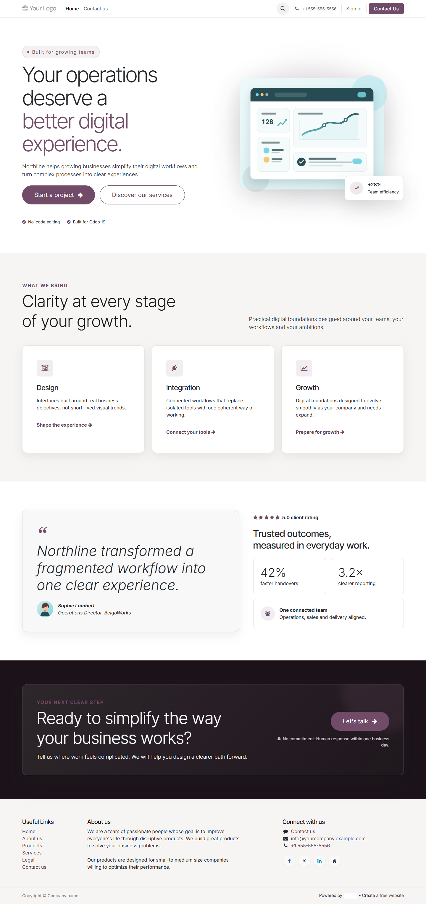
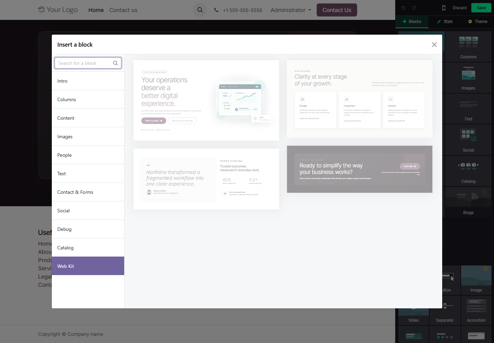

# Odoo Web Kit

Reusable, configurable website building blocks built natively for **Odoo 19
Community**.



Web Kit adds a dedicated category to the Odoo Website Builder with four
production-ready snippets: Hero, Features, Trust and CTA. They can be dragged,
edited, duplicated, reordered and saved with Odoo's standard authoring tools.

[Watch the 72-second product demo](docs/media/odoo-web-kit-demo.mp4)

## Why

This project explores Odoo Website as an actual product platform, not as a
container for standalone HTML. Its goal is to demonstrate a complete vertical
slice: addon packaging, Builder registration, native options, responsive
design, accessibility, lifecycle testing and presentation.

## Components

| Block | Purpose | Native authoring support |
|---|---|---|
| Hero | Value proposition, two actions and visual proof | Text/image/link editing plus alignment, media position and tone options |
| Features | Three clear benefits | Text and link editing, duplication and reordering |
| Trust | Testimonial, identity, rating and outcomes | Text and image editing |
| CTA | Focused final conversion step | Text and link editing |

## Install

Requirements: Odoo 19 Community, Python 3.12 and PostgreSQL 13 or newer.

1. Add this repository's root directory to Odoo's `addons_path`.
2. Update the Apps list.
3. Install **Odoo Web Kit**, or run:

```powershell
python odoo-bin -d <database> -i website_webkit --stop-after-init
```

The addon depends only on Odoo's `website` module and requires no external
runtime package.

## Use

1. Open a Website page and select **Edit**.
2. Drag **Web Kit** from the Blocks panel to the page.
3. Pick Hero, Features, Trust or CTA.
4. Edit content with the native Website tools. Select the Hero to configure
   content alignment, visual position and tone.
5. Save and publish.



## Architecture

```text
website_webkit/
├── __manifest__.py
├── views/snippets/          # Four semantic QWeb snippets and registry entry
└── static/src/
    ├── builder/             # Odoo 19 native Hero option component
    ├── img/                 # Local SVG previews and demo media
    └── scss/                # Namespaced design tokens and component styles
```

The public page ships no custom JavaScript. Bootstrap/Odoo primitives provide
the layout; namespaced SCSS adds the component identity. Builder-only code is
isolated in `website.website_builder_assets`.

## Design and accessibility

- Theme-aware Odoo/Bootstrap color variables instead of a hardcoded palette.
- Semantic headings, native links, alternative text and decorative icons
  hidden from assistive technology.
- Visible keyboard focus, 44 px minimum targets and reduced-motion support.
- Verified at 1440, 1024, 768, 390 and 360 px, plus reflow at 200% zoom.

## Quality evidence

The release gate covers clean install, upgrade, uninstall/reinstall, Builder
drag and drop, persistence, responsive behavior, keyboard navigation, secure
XML/SVG parsing, package budgets and Lighthouse.

```powershell
.\scripts\verify-stage7.ps1 -Full
```

Latest accepted Lighthouse desktop run: **86 performance, 95 accessibility,
96 best practices and 100 SEO**. Web Kit itself transfers 5,877 bytes across
two SVG requests, with no public JavaScript or failed resource.

Detailed evidence is available in
[the Stage 7 delivery report](docs/stage7_delivery.md).

## Screenshots

| Final page | Native integration |
|---|---|
| [Desktop homepage](docs/media/homepage-desktop.png) | [Website Builder](docs/media/website-builder.png) |
| [Mobile homepage](docs/media/homepage-mobile.png) | [Web Kit category](docs/media/web-kit-category.png) |
| [Four-component collection](docs/media/four-components.png) | [Hero options](docs/media/hero-options.png) |

## Next steps

- Add carefully selected options to the remaining blocks.
- Package automated browser acceptance for CI.
- Add translations and test multiple Odoo themes.
- Replace the Northline demonstration copy with reusable demo data.
