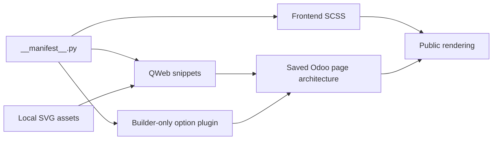

# Architecture

## System map



`website_webkit` depends only on Odoo's `website` module. It defines no Python
model, controller, access rule or database table.

## Decision 1 — Store editable content as native page markup

`views/snippets/snippets.xml` inherits the Website snippet registry and adds one
group with four previews. Each preview inserts a QWeb template whose root is a
single semantic `<section>`.

Odoo copies that section into the page architecture. Text, images and links are
therefore regular Website content rather than values held in a parallel state
store. The Hero option plugin applies mutually exclusive classes for alignment,
media position and tone; Odoo persists those classes with the page.

## Decision 2 — Separate public assets from authoring assets

The manifest sends six namespaced SCSS sources to `web.assets_frontend` and the
Hero option template/plugin to `website.website_builder_assets`.

```text
Public visitor: QWeb + Odoo/Bootstrap + Web Kit SCSS + local SVG
Editor only:    public assets + Hero option Owl template/plugin
```

Selectors are scoped below `.s_webkit_*`, with `.webkit_*` for internal elements
and variants. This prevents Web Kit styles from targeting unrelated page
markup. The public bundle contains no Web Kit JavaScript or remote asset URL.

## Decision 3 — Keep product data separate from demonstration state

The addon installs canonical block templates, not the Northline homepage. The
development page lives in `webkit_dev` and can be rebuilt from those templates
with `scripts/compose-stage3-homepage.py`. Header, footer and demo identity are
applied or restored with `scripts/configure-northline-demo.ps1`.

Browser checks save page state before editing and restore it during cleanup.
Lifecycle checks use a disposable database, isolated HTTP port and unconditional
cleanup. This keeps installable module data independent from screenshots and
local acceptance state.

## Source map

| Path | Responsibility |
|---|---|
| `website_webkit/views/snippets/` | Four QWeb templates and Builder registration |
| `website_webkit/static/src/scss/` | Tokens and component presentation |
| `website_webkit/static/src/builder/` | Hero options available only in the editor |
| `website_webkit/static/src/img/` | Local content and preview SVG files |
| `scripts/` | Development composition, browser checks and lifecycle acceptance |

See [Testing](testing.md) for the executable contracts around these boundaries.
